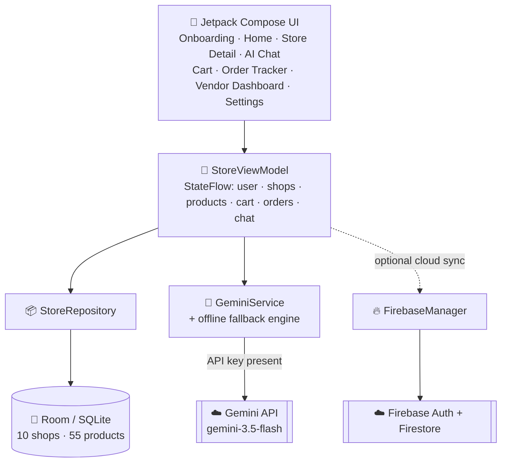
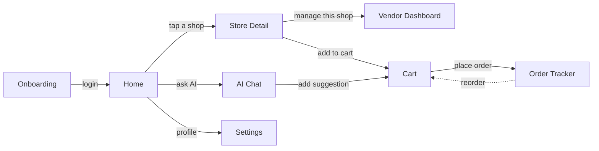

<div align="center">

# 🏪 My Local Store

#

## Overview

**My Local Store** is an Android app that turns the neighborhood *kirana* store, the *sabzi mandi*, the family *mithai* shop, and every other small local business into a searchable, chat-able, one-tap-away marketplace — without asking any of them to build a website.

It pairs a fully **offline-first** shopping experience with a **Gemini-powered AI concierge** that understands requests like *"I want to cook matar paneer"* or *"gift for my mom's birthday"* and turns them directly into a cart of real, in-stock products from real nearby shops. Flip to the other side of the same app, and a shopkeeper gets a live dashboard to manage incoming orders and their catalog — no separate seller app required.

Accessibility is a first-class citizen, not an afterthought: every profile carries an age bracket that automatically resizes text, buttons, and contrast for comfort, and the entire experience — onboarding, AI chat, checkout, everything — is available in **English and Hindi**.


### The problem

- Small-town and village shopkeepers in India rarely have an online storefront, so customers default to large e-commerce apps that don't carry hyperlocal specialties — the fresh vegetable stall, the family sweet shop, the corner medical store.
- Generic shopping apps aren't built for *every* user. First-time smartphone users and senior citizens struggle with dense, English-only interfaces, while younger users want something faster and richer.

### The solution

- Give every nearby shop — kirana to clothing to stationery — a live catalog and an order queue, inside **one app**, with zero technical setup on the shopkeeper's end.
- Let an **AI concierge** do the "figuring out what to buy" so the customer only has to describe what they need, in the language they're comfortable in.
- One login, three UI experiences — **Modern**, **Standard**, or **Simplified** — chosen automatically from the user's age and switchable anytime.

---

## Features

### 🛍️ Customer experience
- Bilingual onboarding (English/Hindi) capturing name, phone (OTP-verification flow), age bracket, and home location
- Home feed with category chips — Kirana, Sabji, Sweet Shop, Gift Shop, Medicine Store, Clothing Store, Stationery Shop — plus Electronics, Bakery, and Sports shops browsable under "All", and a "Nearest Verified Shops" list sorted by live distance
- GPS auto-detect location with reverse-geocoding to a real street address, plus a manual "popular nearby locations" picker — both degrade gracefully when GPS or permissions aren't available
- Store detail pages with full product catalogs, pricing, and live stock status
- Multi-shop cart with quantity controls and a choice of UPI, Card, or Cash on Delivery
- Five-stage live order tracker — **Placed → Accepted → Packed → Out for Delivery → Delivered** — plus one-tap reorder from history

### 🤖 AI Shopping Concierge ("Local Store AI")
- Natural-language chat grounded in the **real, live product catalog** — the model is explicitly instructed to never invent a product that isn't actually stocked nearby
- Understands intent: grocery runs, gift ideas (for a partner, a mother, etc.), festival shopping, recipes, baby products, party planning, travel essentials, and more
- Ask for a recipe and it returns step-by-step cooking instructions *and* automatically matches every ingredient to an in-stock product from a nearby shop
- Fully bilingual responses that follow the user's saved language preference
- Structured, JSON-only output from Gemini so the UI can reliably render suggested-product carousels and quick-reply chips
- Ships with a **rule-based offline fallback assistant** — the AI chat works end-to-end even with zero API key configured, so anyone can clone and demo it instantly

### 🏬 Vendor / shopkeeper tools
- The same app doubles as a shopkeeper dashboard — tap **"Manage this shop"** from any store page to switch into vendor mode
- **Orders Queue** tab to see and fulfil incoming customer orders in real time
- **Manage Catalog** tab to add new products, edit prices, and toggle stock availability

### ♿ Accessibility & localization
- Every account is auto-tagged **Modern** (dense, animated — under 40), **Standard** (default, 41–55), or **Simplified** (large fonts, high-contrast flat cards, 64dp touch targets — 56+), and it can be changed by hand at any time in Settings
- Complete English ⇄ Hindi toggle across onboarding, navigation, product listings, and AI chat
- Full light and dark theme support with a warm saffron/marigold Material 3 palette

### 💾 Data & sync
- 100% offline-first: everything runs on a local **Room (SQLite)** database, seeded with **10 realistic shops and 55 products** drawn from everyday Indian retail — so the full demo works with zero backend setup
- **Firebase Auth + Cloud Firestore** scaffolding is already wired in (`FirebaseManager.kt`) and activates the moment a `google-services.json` is added — no code changes needed
- Firebase calls are safely try/caught, so the app never crashes when running in offline demo mode

---

## Screenshots

<!--
  Add screenshots or a short demo GIF here before sharing this README — judges look for this first!
  Create a `/screenshots` folder in the repo and reference the images like this:

  | Onboarding | Home | AI Chat | Vendor Dashboard |
  |:---:|:---:|:---:|:---:|
  |  |  |  |  |
-->

*Screenshots / demo video coming soon — add yours to a `/screenshots` folder and link them here.*

---

## How It Works

### Architecture

The app follows an **MVVM** pattern: Compose screens observe `StateFlow`s exposed by a single `StoreViewModel`, which delegates persistence to a repository backed by Room, and shopping intelligence to a dedicated Gemini service.



### Navigation flow



Home, AI Helper, and Cart live in the persistent bottom navigation bar; Store Detail, Order Tracker, Vendor Dashboard, and Settings are reached contextually.

---

## AI Shopping Concierge — a closer look

`GeminiService.kt` sends the model a **system prompt that hard-codes the app's product taxonomy and behavior rules**, plus the user's live local product catalog, so every recommendation is grounded in what's actually in stock nearby:

- **Structured output** — the request sets `responseMimeType: application/json` and defines an explicit schema (`message`, `intent`, `products[]`, `recipe`, `actions[]`), so responses can be parsed directly into UI components instead of scraped from free text.
- **Conversation memory** — prior chat turns are replayed on every call so follow-ups like *"add the second one"* resolve correctly.
- **Grounded recommendations** — the prompt explicitly forbids inventing products; if nothing matches, the assistant says so instead of hallucinating.
- **Graceful degradation** — if `GEMINI_API_KEY` is missing or still the placeholder value, `getLocalFallback()` kicks in: a rule-based matcher that still handles gifting, recipes, groceries, and festival flows bilingually, so the AI experience never feels broken during a demo.

---

## Tech Stack

| Layer | Technology |
|---|---|
| Language | Kotlin 2.2 |
| UI Toolkit | Jetpack Compose · Material 3 |
| Architecture | MVVM — `ViewModel` + `StateFlow` + Repository pattern |
| Local Database | Room (SQLite) 2.7, via KSP |
| AI / LLM | Google Gemini API (`gemini-3.5-flash`) over OkHttp, structured JSON output |
| Cloud Backend | Firebase Auth + Cloud Firestore (BoM 34) |
| Networking | OkHttp, Retrofit + Moshi |
| Location | Android `LocationManager` + `Geocoder` (reverse geocoding) |
| Testing | JUnit, Espresso, Robolectric, Roborazzi (Compose screenshot tests) |
| Build | Gradle Kotlin DSL, AGP 9.1, Secrets Gradle Plugin |
| CI/CD | GitHub Actions — auto-builds a debug APK on every push |
| Min SDK / Target SDK | 24 (Android 7.0) / 36 |

---

## Project Structure

```text
MYlocalstore/
├── app/
│   ├── src/main/
│   │   ├── java/com/example/
│   │   │   ├── MainActivity.kt         # App entry point + every Compose screen
│   │   │   ├── data/
│   │   │   │   ├── Database.kt         # Room entities, DAO, repository, demo data seed
│   │   │   │   ├── FirebaseManager.kt  # Firebase Auth + Firestore sync helpers
│   │   │   │   └── GeminiService.kt    # Gemini API client + offline fallback assistant
│   │   │   └── ui/
│   │   │       ├── StoreViewModel.kt   # App state, navigation, cart/order/AI logic
│   │   │       ├── useLocation.kt      # GPS permission + location-fetch hook
│   │   │       └── theme/              # Color.kt · Theme.kt · Type.kt (Material 3 theme)
│   │   ├── res/                        # Icons, strings, backup/extraction rules
│   │   └── AndroidManifest.xml
│   ├── build.gradle.kts                # App module build config + dependencies
│   └── proguard-rules.pro
├── gradle/libs.versions.toml           # Centralized dependency version catalog
├── .github/workflows/build.yml         # CI: builds a debug APK on every push
├── .env.example                        # Template for GEMINI_API_KEY
├── metadata.json                       # Project metadata
├── build.gradle.kts
├── settings.gradle.kts
└── gradle.properties
```

### Screen map

| Screen | Purpose |
|---|---|
| **Onboarding** | Name, phone (OTP demo), age bracket, language, and home location capture |
| **Home** | Category browser, nearest verified shops, AI banner, location switcher |
| **Store Detail** | Full product catalog for a single shop + "Manage this shop" entry point |
| **AI Chat** | Gemini-powered shopping concierge — recipes, gifting, catalog search |
| **Cart** | Multi-shop cart, quantities, payment method selection |
| **Order Tracker** | Live 5-stage delivery timeline + one-tap reorder |
| **Vendor Dashboard** | Shopkeeper view — order queue + catalog management |
| **Settings** | UI tier, language, location, account, and sync status |

---

## Getting Started

### Prerequisites
- [Android Studio](https://developer.android.com/studio) (Ladybug or newer) with JDK 17
- An Android device or emulator running **API 24+**
- *(Optional, for live AI responses)* a free [Gemini API key](https://aistudio.google.com/app/apikey)

### 1. Clone the repository
```bash
git clone https://github.com/prt07TAK/MYlocalstore.git
cd MYlocalstore
```

### 2. Add your Gemini API key
Create a `.env` file in the project root (next to `.env.example`) and add:
```properties
GEMINI_API_KEY=your_actual_key_here
```
> No key? No problem. The app automatically detects the missing key and switches the AI Chat to its offline rule-based assistant, so it's still fully demoable.

### 3. *(Optional)* Connect Firebase
Drop your own `google-services.json` into `app/` to enable real Google Sign-In and Firestore sync. The build works fine without it — `MissingGoogleServicesStrategy.WARN` and `googleServices.missing.passthrough=true` are already configured, so its absence only logs a warning instead of failing the build.

### 4. Open & run
Open the project in Android Studio, let Gradle sync, then run on a device or emulator (API 24+).

### 5. Or build a debug APK from the command line
```bash
./gradlew assembleDebug
```
If local signing fails, generate a debug keystore first (this mirrors what CI does automatically):
```bash
keytool -genkey -v -keystore debug.keystore -storepass android \
  -alias androiddebugkey -keypass android -keyalg RSA -keysize 2048 \
  -validity 10000 -dname "CN=Android Debug,O=Android,C=US"
```

---

## Roadmap

- [ ] Replace simulated OTP with real SMS verification (Firebase Phone Auth)
- [ ] Turn on live Google Sign-In + Firestore sync (already wired — just needs `google-services.json`)
- [ ] Push notifications for order status changes (FCM)
- [ ] Real payment gateway integration (UPI deep-link / Razorpay)
- [ ] Google Maps SDK for live map view and delivery tracking
- [ ] Self-service vendor onboarding (shops are currently demo-seeded)
- [ ] Customer ratings & reviews per shop
- [ ] Play Store release

---


## License

This repository does not yet include a license file. Until one is added, all rights are reserved by the author. If you'd like this project to be open source, adding the [MIT License](https://choosealicense.com/licenses/mit/) is a common, permissive choice for hackathon projects.

---

<div align="center">

Made by [prt07TAK](https://github.com/prt07TAK) · *Add your team name, hackathon name, and demo link here* 🚀

</div>
